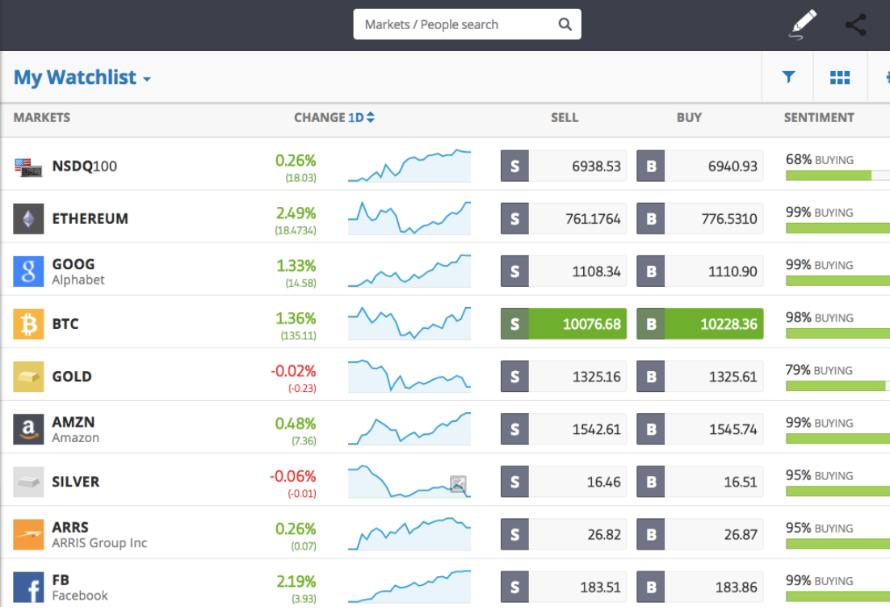
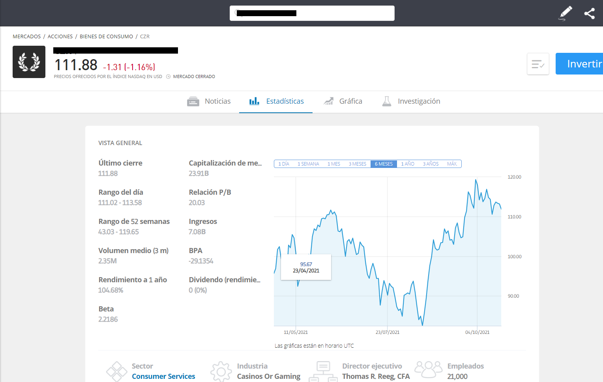
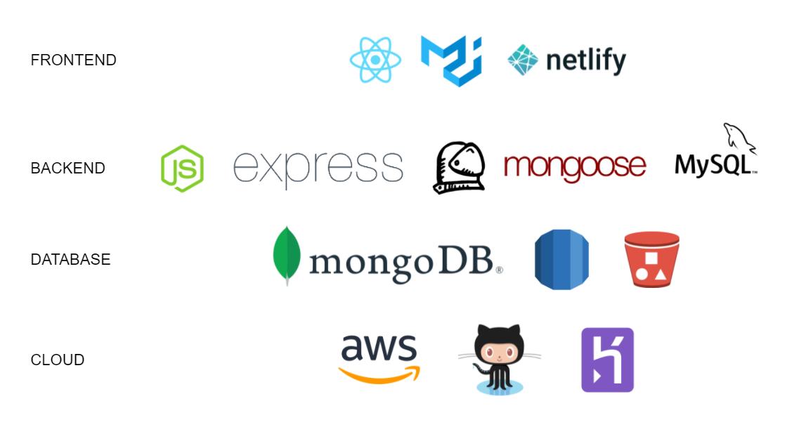

# Calculadora Verde MVP - Hackathon BBVA 2021
<!-- For the title I usually like to have a structure like: Technical Design Review - %PROJECT_CATEGORY% -->

## 🔮 Idea general 🔮
<!-- Start at the beginning. What problem are you trying to solve? If you jump straight into solutions, it will be hard for people to orient themselves and will inevitably lead to misalignment and misunderstanding. It’s worth spending 2 or 3 sentences to effectively set the context for your spec.

Then, briefly state your proposed solution. This should be enough for most people to decide whether they should continue reading and should be understandable by someone who is not familiar with the project. Between a few sentences and two paragraphs should be enough.-->

El mercado cada vez más está considerando la importancia de integrar soluciones de impacto 0 medioambiental. Esto hace que las marcas y las empresas se vean forzadas a integrar procesos y conocimiento sobre éste ámbito.
 
Por ello, queremos proponer un panel de control interactivo que muestra de forma sencilla toda la información medioambiental. El valor añadido es poder asesorar a las empresas sobre los puntos de mejora para disminuir su impacto medioambiental. Datos como las emisiones de CO2, el gráfico de evolución del impacto medioambiental e insights generados a partir de los consumos de gas, diesel y gasolina, entre otros estarán contemplados.

## 💡 Motivación 💡

<!-- It’s unlikely that writing the design document is the first time you’ve thought about the problem. The background section is an opportunity to bring readers up to speed, and share the context you have on the problem space.

What are the motivations for the project or design? Is there any historical perspective that will help people understand the proposal? Has someone tried to solve the problem in the past? If so, why are those solutions no longer appropriate? Are there any other things going on that will affect the design?-->

El ser humano lleva más de una década que conoce el problema medioambiental que estamos generando, también sabe que si para 2050 no ponemos remedio a nuestra forma de vida, la vida en este planeta empezará cada vez a ser más insostenible.
 
Al ser el problema medioambiental un problema de carácter general, varias personas ya han hipotetizado, investigado e incluso empezado a desarrollar una serie de soluciones a este problema.
 
Haciendo un análisis de mercado sobre las Calculadoras Verdes, hemos encontrado que gran parte de las soluciones están pensadas para que una persona u empresa pueda insertar sus datos, con un esquema tipo formulario, recibiendo como respuesta una calificación medioambiental y en algunos casos sugerencias sobre cómo mejorar.
 
Nosotros queremos ir un paso más allá y proporcionar una forma sencilla y visual de hacer un seguimiento en el tiempo de dichas empresas y actividades medioambientales integrando todas las funcionalidades comunes en las Calculadoras Verdes.

## ⚓ Objetivos, no objetivos y futuros objetivos ⚓

### ✅ Objetivos ✅

<!-- In order to build alignment and communicate a definition of done, it is important to clearly articulate the goals of this work. The best goals are simple, truthy sentences that describe a future state of the world. Unlike an OKR, it’s fine for these goals to be hyper-specific. Projects will often have 3-5 goals. -->

- Panel de control con vista tipo lista de todas las empresas con ciertos datos relevantes.
 
- Panel de control con vista detallada por cada empresa con todos los datos medioambientales que podamos proporcionar y calcular.
 
- Datos por tipo de emisión :
    - *Emisiones directas* : tipo de sector, GHG Protocol, tipo de producto/servicio, combustión estacionaria, combustión móvil, procesos industriales, Liberación de GEI en sistemas antropogénicos, uso del suelo, los cambios de uso del suelo y la silvicultura.
 
    - *Emisiones indirectas* : transporte hasta cliente final, gastos energéticos, extracción, transporte y procesamiento del combustible, Producción de los bienes de capital, pérdidas por transporte y distribución, electricidad importada, energía importada, excluyendo la electricidad.
 
    - *Otras emisiones indirectas* : combustible quemado en los medios de transporte, fugas de gases de refrigeración, aguas arriba provenientes de la generación y del transporte/distribución del combustible, construcción de los medios de transporte, transporte y distribución de bienes aguas arriba, provenientes de fletes pagados por la organización, transporte y distribución de bienes aguas abajo, que no son costeados por la organización, desplazamiento diario de los empleados o teletrabajo, transporte de clientes y visitantes, a las instalaciones de la compañía, viajes de negocio, debidas a combustible consumido en las fuentes móviles. Se pueden incluir las noches de hotel del viaje de negocio, provenientes de los productos comprados, fase de aguas arriba de los productos comprados debidas a su fabricación, Fase de aguas arriba de la producción de todos los bienes de capital comprados y amortizados: equipos, maquinarias, edificios, instalaciones y vehículos, disposición de residuos sólidos y líquidos. Las emisiones provenientes del transporte de de los residuos se pueden cuantificar aquí o en el apartado de emisiones debidas al transporte, equipos arrendados por la organización, otros servicios, como consultoría, limpieza, mantenimiento, correos, mensajería, bancos, etc, provenientes del uso del producto durante su vida útil, etapa de fin de vida del producto vendido, provenientes de las inversiones.
 
- Datos por categoría :
    - *Producto* : tipo de sector, GHG Protocol, tipo de producto/servicio, transporte hasta cliente final,
    Gestión energética, reciclaje y gestión de residuos.
    - *Gestión* : grado de automatización de los procesos, aumento de la inversión, grado de digitalización, tipología de ERP, Cantidad de siniestros y negligencias.
    - *Empleados* : grado de teletrabajo vs presencial, m2 de las oficinas y vestimenta reglamentaria de los empleados, numero de empleados, viajes relacionados con el trabajo.
 
- Creación de una calificación absoluta, objetiva y ponderada sobre el impacto medioambiental de dicha empresa.
 
- Creación de un gráfico de evolución de emisiones CO2.
 
- Creación de una API que devuelva toda los datos mejorados respecto a las emisiones de las empresas que hemos proporcionado.
 
- Creación de un modelo de mejora para los datos proporcionados.
 
- Integración de procesos y fuentes de datos para mejorar la calidad de lso datos proporcionados.

### ❌ No Objetivos ❌

<!-- As well as explaining what you want to achieve, it is equally important to say what you are explicitly not addressing. These can sometimes be hard to identify, but imagine what another person might expect to be coupled with this work. -->

- No ofreceremos una solución de tipo convencional donde el usuario pueda insertar sus datos y recibir una calificación energética.

### 🤞🏻 Futuros Objetivos 🤞🏻

<!-- Future goals are an opportunity to list things you want to do in the future, but have descoped for this phase of the project. In other words, these are things you want to make sure your solution doesn’t accidentally make difficult or 
impossible. -->

- Integración de un apartado de sugerencias para mejorar la calificación energética de la empresa.
- Integración de un apartado de noticias medioambientales de interés.
- Test unitarios, integración y e2e de las funcionalidades propuestas.
- Migración de JavaScript tanto en frontend como en backend a TypeScript por el beneficio en seguridad que este aporta.
- Nos enfocaremos solo en la versión desktop de nuestra UI, versiones móvil y tablet quedan relegadas a un futuro desarrollo.

## ⚙️ Especificaciones técnicas ⚙️

<!-- What are the user requirements?
What systems will be affected?
What new data structures are needed, what data structures will be changed?
What new APIs will be needed, what APIs will be changed?
What are the efficiency considerations (time/space)?
What are the expected access patterns (load/throughput)?
How will data be validated and what are the potential error states?
Are there any logging, monitoring or observability needs?
Are there any security considerations?
Are there any privacy considerations?
Are there any mobile considerations?
Are there any web-specific considerations?
How will the changes be tested?
How does internationalization and localization — translations, time zones, unicode, etc. — affect your solution? -->

### Histórias de usuario
Como responsable de cuentas me gustaría poder tener un panel de control donde poder ver de forma sencilla todos los datos medioambientales de las empresas de nuestra base de datos mejorados y cruzados con datos de dominio público.
Adicionalmente a esto me gustaría tener una vista detallada de cada empresa con un análisis más detallado para poder promover diferentes productos y asesoramiento.

### Limitaciones técnicas
Después de hacer una extensa búsqueda en las fuentes de datos, parece ser que no hay un ente internacional que regula todos estos aspectos más allá de GHG Protocol. Por ello y por el corto tiempo nos centraremos en fuentes de datos publicos que reflejan la situación de México y LATAM, dejamos la posibilidad de en futuras versiones escalar a la solución a nivel global.

### Formulas de cálculo de emisiones

- *Emisiones del hogar* : 
    - **Electricity** : use (kWh/yr) * EF (kg CO2e/kWh) = emissions (kg CO2e/yr)
    - **Natural Gas** : use (therms/yr) * EF (kg CO2e/therms) = emissions (kg CO2e/yr)
    - **Fuel Oil**: use (litres/yr) * EF (kg CO2e/litre) = emissions (kg CO2e/yr)
    - **LPG** : use (litres/yr) * EF (kg CO2e/litre) = emissions (kg CO2e/yr)
    - **Waste** : use (kg/week) * 52 * EF (kg CO2e/kg) = emissions (kg CO2e/yr)
    - **Water** : use (litres/day) * 365 * EF (kg CO2e/kWh) = emissions (kg CO2e/yr)

- *Viajes* : 
    - **Vehicle** : distance (km/yr) /*EF (kg CO2e/km) = emissions (kg CO2e/yr)
    - **Bus** : distance (km/yr) * EF (kg CO2e/km) = emissions (kg CO2e/yr)
    - **Metro**: distance (km/yr) * EF (kg CO2e/km) = emissions (kg CO2e/yr)
    - **Taxi**: distance (km/yr) * EF (kg CO2e/km) = emissions (kg CO2e/yr)
    - **Rail**: distance (km/yr) * EF (kg CO2e/km) = emissions (kg CO2e/yr)
    - **Flying** : distance (km/yr)* 1.09 * EF (kg CO2e/km) = emissions (kg CO2e/yr)

- *Alimentos* : 
    - **Red meat**: consumption (kCal/day)*365*EF (kg CO2e/kCal) = emissions (kg CO2e/yr)
    - **White meat**: consumption (kCal/day)*365*EF (kg CO2e/kCal) = emissions (kg CO2e/yr)
    - **Dairy**: consumption (kCal/day)*365*EF (kg CO2e/kCal) = emissions (kg CO2e/yr)
    - **Cereals**: consumption (kCal/day)*365*EF (kg CO2e/kCal) = emissions (kg CO2e/yr)
    - **Vegetables**: consumption (kCal/day)*365*EF (kg CO2e/kCal) = emissions (kg CO2e/yr)
    - **Fruit**: consumption (kCal/day)*365*EF (kg CO2e/kCal) = emissions (kg CO2e/yr)
    - **Oils**: consumption (kCal/day)*365*EF (kg CO2e/kCal) = emissions (kg CO2e/yr)
    - **Snacks**: consumption (kCal/day)*365*EF (kg CO2e/kCal) = emissions (kg CO2e/yr)
    - **Drinks**: consumption (kCal/day)*365*EF (kg CO2e/kCal) = emissions (kg CO2e/yr)

- *Productos* : 
    - **Electrical** : spend ($/month) * 12 * EF (kg CO2e/$) = emissions (kg CO2e/yr)
    - **Household** : spend ($/month) * 12 * EF (kg CO2e/$) = emissions (kg CO2e/yr)
    - **Clothes** : spend ($/month) * 12 * EF (kg CO2e/$) = emissions (kg CO2e/yr)
    - **Medical** : spend ($/month) * 12 * EF (kg CO2e/$) = emissions (kg CO2e/yr)
    - **Recreational** : spend ($/month) * 12 * EF (kg CO2e/$) = emissions (kg CO2e/yr)
    - **Other** : spend ($/month) * 12 * EF (kg CO2e/$) = emissions (kg CO2e/yr)

- *Servicios* : 
    - **Health** : spend ($/month) * 12 * EF (kg CO2e/$) = emissions (kg CO2e/yr)
    - **Finance**: spend ($/month) * 12 * EF (kg CO2e/$) = emissions (kg CO2e/yr)
    - **Recreation**: spend ($/month) * 12 * EF (kg CO2e/$) = emissions (kg CO2e/yr)
    - **Education** : spend ($/month) * 12 * EF (kg CO2e/$) = emissions (kg CO2e/yr)
    - **Vehicle**: spend ($/month) * 12 * EF (kg CO2e/$) = emissions (kg CO2e/yr)
    - **Communications** : spend ($/month) * 12 * EF (kg CO2e/$) = emissions (kg CO2e/yr)
    - **Other** : spend ($/month) * 12 * EF (kg CO2e/$) = emissions (kg CO2e/yr)

### GDPR y tratamiento del dato
Nos regimos, para el alcance del MVP, en la legislación mexicana referente al tratamiento del dato privado y público.
En caso de desarrollar este proyecto a nivel global deberíamos considerar las diferentes legislaciones de GDPR y tratamiento del dato a nivel geográfico. 

### Técnicas y procesos de big data
- Profile report
- Normalización del dataset
- Eliminación de datos duplicados
- Eliminación de registros no representativos
- Ingeniería inversa de datos
- Uso de clustering para agrupar las empresas y no tener que analizarlas individualmente
- Se utiliza el sistema de nomenclatura comercial internacional *Standard Industrial Classification (SIC)*.

### Fuentes de datos y APIs
- [Códigos de actividad económica](https://www.sii.cl/ayudas/ayudas_por_servicios/1956-codigos-1959.html)
- [API de Climatewatch](https://www.climatewatchdata.org/data-explorer/historical-emissions?historical-emissions-data-sources=cait&historical-emissions-gases=all-ghg&historical-emissions-regions=All%20Selected%2CMEX&historical-emissions-sectors=All%20Selected&page=1)
- [Eurostat statistics](https://ec.europa.eu/eurostat/statistics-explained/index.php?title=Greenhouse_gas_emission_statistics_-_carbon_footprints)
- [Center for International Climate Research - Figures from the Global Carbon Budget 2020](https://folk.universitetetioslo.no/roberan/GCB2020.shtml)

### Dipositivos coniderados
Para el MVP de nuestra solución solo consideramos un desarrollo exclusivamente en entorno web para dispositivos de dimensiones ordenador portátil y desktop.

### Test y prubas técnicas
Para una primera versión el test lo haremos de forma manual pero, en caso de continuar con el desarrollo del proyecto a futuro consideramos implementar test unitario, test de integración y test de extremo a extremo utilizando principalmente frameworks como Jest, Mocha y Cypress.

## 🎨 Prototipos y diseño 🎨
Para nuestro panel de control contemplamos dos tipos de vista diferentes: vista general y vista en detalle.

### Vista general de las empresas
Para la vista general nos queremos inspirar en un diseño parecido al de abajo.

### Vista en detalle de la empresa
Para la vista en detalle queremos inspirarnos en un diseño parecido al siguiente:
  

## 🤖 Stack técnico 🤖

<!-- Frontend -->
- [React](https://reactjs.org/docs/getting-started.html) : adoptaremos el frontend de nuestra aplicación con react por su sencillez de uso, extensión en la comunidad de desarrollo y facilidad para adoptar la aplicación nativa con [React Native](https://reactnative.dev/docs/getting-started).
- [Material UI](https://mui.com/): proporciona una gran variedad de componentes preconfigurados compatibles con [React](https://reactjs.org/docs/getting-started.html) por lo que delegamos la interfaz gráfica y experiencia de usuario a ésta librería.
- [Netlify](https://www.netlify.com/) : desplegamos nuestro frontend usando la plataforma cloud de Netlify. Ésta decisión está tomada basándose en el objetivo del proyecto que es crear una versión demo o MVP de nuestra solución. En un futuro lo ideal sería desplegar nuestro frontend en [AWS](https://aws.amazon.com/es/getting-started/hands-on/build-react-app-amplify-graphql/).

<!-- Backend -->
- [Node](https://nodejs.org/es/docs/) : adoptaremos el backend de nuestra aplicación con NodeJS ya que tiene un ecosistema de librerías perfecto para el desarrollo de servicios y comparten lenguaje de base con ReactJS lo que permite reutilizar recursos IT.
- [Express](https://www.npmjs.com/package/express) : Estando en el ámbito de NodeJS, express provee una forma sencilla y out of the box de crear servidores y aplicaciones.
- [Helmet](https://www.npmjs.com/package/helmet) : por motivos de seguridad y por la facilidad de uso con Express, helmet proporciona un middleware que actúa como un Facade de OOP el cual por debajo automatiza ciertas buenas prácticas que hacen los intercambios de información entre front y back más seguros.
- [MySQL](https://www.npmjs.com/package/mysql) : delegamos la conexión y la gestión de SQL queries a ésta librería de NPM.
- [Mongoose](https://www.npmjs.com/search?q=mongoose) : delegamos la conexión y gestión de queries a bases de datos no relacionales así como la creación de los esquemas a esta librería de npm.
- [Otras librerías de NPM]() : usaremos librerías como *body-parser*, *cors* y *dotenv* para añadir habilidades a nuestra aplicación de controlar los parámetros de las llamadas HTTP, el orígen de dichas llamadas y la gestión de variables de entorno.
- [Heroku](https://aws.amazon.com/es/ec2/?ec2-whats-new.sort-by=item.additionalFields.postDateTime&ec2-whats-new.sort-order=desc) : desplegamos nuestro servicio de backend en el proveedor cloud de Heroku en vez de un [EC2 de AWS](https://aws.amazon.com/es/ec2/?ec2-whats-new.sort-by=item.additionalFields.postDateTime&ec2-whats-new.sort-order=desc) ya que por motivos de MVP, heroku provee una facilidad mayor en términos de despliegue con nuestro repositorio de código en [GitHub](https://github.com/VictorGreco/hackathon-bbva-2021).
- [GitHub & Git](https://github.com/) : el repositorio principal de nuestro código estará en GitHub ya que éste ofrece una gran facilidad de integración con otras plataformas cloud. 

<!-- Databases -->
- [S3 AWS](https://aws.amazon.com/es/s3/) : implementaremos un servicio de almacenamiento cloud de archivos estáticos como s3 de AWS para la gestión de los archivos de datos principales.
- [RDS AWS](https://aws.amazon.com/es/rds/) : usaremos el servicio de bases de datos relacional de AWS para el volcado de los datos iniciales proporcionados y guardar las mejoras de los diferentes datos en el mismo.
- [MongoDB Atlas](https://www.mongodb.com/atlas/database) : en caso de necesitar un soporte temporal de cálculo planteamos usar un servicio gratuito de MongoDB con el proveedor de Atlas.

<!-- 3rd party APIs -->
- [APIs y datos de terceros](https://github.com/VictorGreco/hackathon-bbva-2021/blob/main/TDR.md#third-party-considerations) : visita la sección *Third-party considerations* para más información.

## 📚 Otros recursos 📚

- [Canvas](https://docs.google.com/drawings/d/15fluS7dNZnYVzJOZF_jkzR-5FCfLUPFGq3hQFZ6uvCc/edit)
- [Slides](https://www.canva.com/design/DAEtkL1Kg2g/FOaSGUvGc59WjMyYzacdgw/view?utm_content=DAEtkL1Kg2g&utm_campaign=designshare&utm_medium=link&utm_source=shareyourdesignpanel#1)